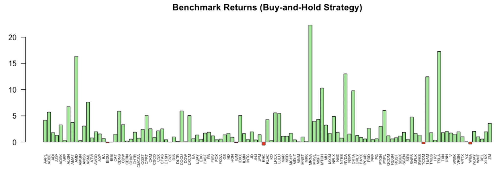

```{r setup, include=FALSE}
knitr::opts_chunk$set(echo = TRUE)
```

## Problem Statement

Stock prices are usually represented as a line graph where each point represents
the closing price on a given trading day. Another common way to represent stock 
prices is with candlestick charts. The candlestick method includes additional 
information about the opening, maximum, and minimum prices for any given trading 
day, represented as a chart icon resembling a candle with two sticks.

It is commonly believed that certain candles and candlestick chart patterns are
more favorable than others when determining the likelihood of a trade being
profitable.

The goal of this project is to analyze historical prices, in the form of
candlestick charting data, and determine a charting pattern that has been
historically profitable.

Note: All relevant code is housed in the associated <a href="https://github.com/dpsciarrino/price-action-data-analysis">GitHub repo</a> for this project.

## Collecting the Data

Candlestick data is usually accessible as a CSV file. The columns of candlestick
data are usually represented as Date, Open, High Low, and Close. From here on we
will refer to this data as OHLC Data (Open-High-Low-Close).

TD Ameritrade has a free desktop trading platform called ThinkOrSwim. Within 
the software, one can create scripts using a proprietary language developed by 
TD Ameritrade called ThinkScript. A script written by Kory Gill was posted
on the <a href="https://useThinkScript.com">useThinkScript</a> Forum. This is 
shown below:

```
declare upper;
declare once_per_bar;

input start_of_day = 930;		# 9:30 AM
input end_of_day = 1600;		# 4:00 PM

def adjStart = start_of_day;
def adjEnd = end_of_day;

def agg_period = GetAggregationPeriod();

def buy_trigger = if agg_period >= AggregationPeriod.DAY then 1 else if SecondsTillTime(adjEnd) >= 60 and SecondsFromTime(adjStart) >= -60 then 1 else 0;

AddOrder(OrderType.BUY_TO_OPEN,
	buy_trigger,
	low,
	1,
	Color.Black,
	Color.Black, name="SOHLCP|"+GetSymbol()+"|"+open[-1]+"|"+high[-1]+"|"+low[-1]+"|"+close[-1]+"|"+close);

AddOrder(OrderType.SELL_TO_CLOSE, buy_trigger, high, 1, Color.Black, Color.Black, name="SellClose");
```

The results from running this ThinkScript were saved into the '''data/store''' folder.

Another set of Earnings data for each of the stocks we extracted using the above script 
was obtained using a modified version of Kory's script. This is shown below:

```
declare upper;
declare once_per_bar;


def isBefore = HasEarnings(EarningTime.BEFORE_MARKET);
def isAfter = HasEarnings(EarningTime.AFTER_MARKET);
def actualEarnings = if !IsNaN(GetActualEarnings()) then GetActualEarnings() else -1;
def estimatedEarnings = if !IsNaN(GetEstimatedEarnings()) then GetEstimatedEarnings() else -1;


AddOrder(OrderType.BUY_TO_OPEN,
    HasEarnings(),
    low,
    1,
    Color.Black,
    Color.Black, name=""+GetSymbol()+"|"+isBefore+"|"+isAfter+"|"+actualEarnings+"|"+estimatedEarnings);

AddOrder(OrderType.SELL_TO_CLOSE, HasEarnings(), high, 1, Color.Black, Color.Black, name="SellClose");
```

The results of this script were stored in the same data/store folder.

## Cleaning the Data

The raw data extracted from ThinkOrSwim is hardly usable unless cleaned. R provides the
tools to be able to clean the data. Below is an example of one of the extracted data 
files.


A number of steps were taken to clean these files, the code for which can be found
in the ``` OHLC_store_to_processed.R ```.file. The main steps were:

1. Ignore the header data.
2. Only consider the lines with 'Buy to Open.'
3. For each of the lines that follow the criteria in Step 2, split on the 
semicolon (;) character.
4. Extract the data and replace the slashes '/' with dashes '-'.
5. Extract the pricing data, which was then split on the pipe '|' character.

The results of this parsing were put into the data/processed folder. The resulting 
folder's contents are shown in the screenshot below:


The same type of cleaning procedure was performed on the Earnings data. Below is an example of the raw earnings data extracted from ThinkScript:


A similar set of parsing rules were used to clean the above Earnings data to obtain the following format:


## Exploratory Data Analysis

After collecting and cleaning historical pricing and earnings data, it is important
to "make sense" of it. One way to do this is to make an hypothesis and perform 
operations on the data that test that hypothesis. The first hypothesis we will 
make is that price gaps between one day and the next can be exploited. The second
hypothesis we will make is that the timeframe surrounding earnings can be exploited.

### EDA: Gap Detection

Let's look at the first hypothesis: gaps in price can be exploited. The stock market is “open” to the general public for trading from 9:30AM to 4PM each
business day. However, some firms have special access to the market during ‘pre-market’ hours. In these ‘pre-market’ sessions the price of various securities can
change. A “gap” is a change in price where there is an apparent spacing between the
candlestick of one day and the next.

Let’s define an “upward gap” to be when the opening price of today exceeds the high
of the previous day (below, left). Alternatively, a “downward gap” is when the opening
price of today is lower than the low of the previous day (below, right).

 


After a stock price gaps, there is a chance that the gap “fills” during the course of the
day. That is, if the stock gapped up overnight there is a chance that the price comes
back down to the high of the previous day. If the stock
gapped down overnight, there is a chance that the price comes back up to the low of
the previous day.

Now, we are interested in the following questions:

1. In a given interval (in this case 5 years), how often does the stock price ‘gap’
outside of normal market hours?

2. Of the number of gaps that occur, how many are upward gaps? How many are
downward gaps?

3. Of the number of gaps that occur, how many of the gaps “fill”?

4. Which stocks “fill” their gaps most often?

All the R code for this section can be found in the file ```gap_identifier.R``` on the Github.

#### How often does the stock price gap?

We need to play with the pricing data frame in order to figure out whether there was a
gap in price between today and the previous trading day. The ‘for’ loop between lines
33 and 134 populates the following columns in the ‘gap_info_df’ data frame:

1. Gap_Fill_Percentage: The percentage of gaps that occur in the dataset.

2. Upward_Gap_Fill_Percentage: The percentage of upward gap within the total number of gaps.

3. Downward_Gap_Fill_Percentage: The percentage of downward gap within the total number of gaps.

The figure below shows a box plot generated based on the data calculated in the
Gap_Fill_Percentage column. Specifically, it shows the min-max range of the
percentage of gaps being around 63% and 79%. The mean percentage lies around
72%. Essentially, this is telling us that gaps occurred on average 72% of the time in the DOW 30 stocks within the last 5 years.


#### How often did upward gaps occur? How often did downward gaps occur?

The next two questions concern how many upward gaps occur and how many
downward gaps occured in the DOW 30. The figures below show that around 57% and 43%
of gaps are upward or downward, respectively.


#### How many of the gaps "fill"?

The figure below shows that, of the number of upward gaps that occur, approximately 72% of
them fill within one trading day. Likewise, of the number of downward gaps that occur,
a similar percentage of them have filled within one trading day within the past 5 years.


#### Which stocks have "filled" their gaps most often?

Now that we know on average approximately 72% of the stocks in the DOW 30 fill their
gaps, it would be helpful to know the ones that fill the gap most often. The first figure below shows
the top 10 stocks that generally fill. The second figure shows the top 10 stocks that
filled upward gaps. The third figure shows the top 10 stocks that filled downward gaps.


#### Summary for Gap Fill Detection
From the data above, we can make the following observations:

1. Gaps occurred 72% of the time within the past 5 years in the DOW 30 index.

2. Among the gaps that occurred, 57% were upward-moving and 43% were
downward-moving.

3. The percentage of upward and downward moving gaps that fill within one trading
day is roughly 72% with no discrepancy between upward/downward movement.

4. The Top 10 stocks whose gaps are filled are: AMGN, PG, MCD, TRV, UNH, WBA, WMT, MRK, V, VZ

5. The Top 10 stocks whose upward gaps are filled are: TRV, AMGN, WBA, MCD, VZ, UNH, PG, HD, MMM, MRK

6. The Top 10 stocks whose downward gaps are filled are: V, WMT, AMGN, JNJ, PG, UNH, DIS, MSFT, CRM, MRK


### EDA: Pre- and Post-Earnings Zones

One important event that happens for every stock in the market is the earnings report.
This is a report that occurs every quarter. Since we have access to earnings data, we
can perform some basic analysis on how the price performs in relation to the date of
the earnings announcement.

In the R code ```earnings_study.R``` I’ve defined two constants: PRE_EARNINGS_RANGE
and POST_EARNINGS_RANGE. For this report, I’ve fixed them to 8 and 15,
respectively. These represent the number of days before and after the earnings date for
which we will look at the price action.

#### Returns

Before going into the analysis, it helps to know about how returns are calculated over a
period of time. If I have $100 invested, and that investment grows 5% over one interval,
then at the end of that interval I will have $105. In other words, the total return can be
summarized as a multiplier value of 1.05, or (1 + 5%).

If the next interval ends with a 5% decrease, then I will have 5% less of $105, or
$99.75. That is, our original investment multiplied by 1*(1+5%)*(1-5%) = 0.9975.
Therefore, calculating the true return multiplier requires a repeated multiplication of
(1+r_i) where ‘r_i’ is the percent return of the i-th day. This is the approach I took in
earnings_study.R. The daily returns are calculated in lines 44-47.

#### Pre-Earnings and Post-Earnings Zone

A period of 8 days prior to earnings day was chosen to measure the returns in preearnings environments. Likewise, a period of 15 days was chosen to measure the
returns in post-earnings environments.
As can be seen in the figure below, the mean of means and the variation in the mean returns
of the stock in the DOW 30 does not vary significantly across Pre- and Post-Earnings
periods.


A range of returns can be calculated as the max value of the returns in a given period
subtracted by the min value of the returns in a given period. This is meant to loosely
represent the amount of volatility in any given timeframe. The next figure shows the range of
fluctuation in returns during the Pre- and Post-Earnings periods, respectively. It can be
seen that the returns fluctuate much more during the Post-Earnings period than during
the Pre-Earnings period, though the average fluctuation (the thick black line) is
relatively the same.


## Modeling and Analysis

### Evaluation Parameters

The purpose of this project is to see if we can develop a trading strategy that relies
solely on historical pricing, earnings, and dividend date data. How should we measure
how well the strategy model is? We need a benchmark and some metrics. The
benchmark we’ll use is the “buy-and-hold” strategy for each individual stock. Basically,
if we were to simply purchase the stock 5 years ago, what does that experience look
like in comparison with the model?

The metrics we need will focus on two (2) main factors:

#### Total Returns

The simplest measure of the goodness of a strategy is to look at the total return.
The return on day i is multiplied by the return from the (i-1)-th day. This is continued
until day N. The equations below specify the method of returns calculation I have use
in this report.


#### Capital Preservation

Sometimes a particular strategy doesn’t do as well in terms of total returns, but
the method is “safer.” For example, a strategy that does very well in total returns could
have periods of time where the volatility is very high, and thus could limit what you are
able to do with your capital during that time. If this is a concern, then it is desirable to
preserve your investment as much as possible and safeguard it against large
downswings in the market.

An example would be the pandemic dip of 2020 shown in the figure below. Stocks suffered a
major drawdown in March 2020, but have since fully recovered. The total return from
2019 to 2021 is a net gain, but the drawdown during those 2-3 years is very large. Do
strategies exist where such a down swing could have been avoided?


We can incorporate a metric into our model that allows for us to measure the maximum
drawdown (MDD). In the case above, the MDD is approximately -35% during March
2020. A function for computing the maximum drawdown was built in R and is
housed in the file ```fin_algos.R```.

### The Benchmark

First, let’s provide a benchmark analysis on the DOW 30 and NASDAQ 100 stocks. The
benchmark relies on the “Buy-and-Hold” strategy. We will take the benchmark return of
the DOW30 stocks to be the average of the total returns across all DOW 30 stocks.
Likewise for the NASDAQ 100 stocks.

The first figure below shows the total returns for the buy-and-hold benchmark. Negative returns are
highlighted in red and positive returns are highlighted in green. The average of these
returns is 2.62, or a gain of 162%.

A measure of variation in the returns for the buy-and-hold strategy can be summarized
by calculating the standard deviation of the returns. The second figure below shows the standard
deviations for each stock using the buy-and-hold. On average, the standard deviation
is ± 0.01706.

The third figure below shows the maximum drawdowns experienced during the investment term for
each stock using the buy-and-hold benchmark strategy. This represents the maximum
percentage loss from any particular peak. The average maximum drawdown is
-39.92%, largely due to the reactions experienced in March 2020 towards the
COVID-19 pandemic.




### Gap Reversal Strategy

In Phase 4, with the help of EDA, we learned that gaps occurred on average 72% of
the time in DOW 30 stocks. Of those gaps, ~43% of them were downward gaps.
Additionally, 72% of those downward gaps rise in price the next trading day to “fill”
their gap. Following this observation, it may be beneficial to detect a downward gap,
purchase at the opening price of the next day and sell at the low price from the
previous day.

The following strategy model employs the following method:

1. Define a stop-loss percentage: STOP_LOSS_PERCENT = $\beta$

2. Detect a downward gap, following the condition:


3. ‘Buy’ the stock at the Open of today.

4. Calculate the stop level using the formula:


5. ‘Sell’ the stock when one of two following conditions are met: (1) The stock price lowers to the threshold ‘StopPrice’ level. (2) Stock price goes up to the Low of yesterday.


#### Gap Reversal Strategy Returns

Using the above strategy yields the returns for each stock shown in the below figure. The
average return for this strategy is 1.328749, or a gain of 32.87%. This is about 130%
lower than the average returns for the benchmark approach, and assumes a beta value
of 0.10 (10% stop loss).


#### Gap Reversal Standard Deviation

To measure the volatility, the standard deviation for the strategy is shown in the below figure.
The average standard deviation is 0.006277. This is much lower than the 0.01706 we
observed in the buy-and-hold case.


#### Gap Reversal Strategy Drawdown

The figure below shows the max drawdowns for the gap down strategy. The average maximum
drawdown is -39.54%, which is about the same level as the benchmark.


#### Adjusting the Stop Loss Value in the Gap Reversal Strategy

Implementing the above with varying $\beta$ values yields different returns, standard
deviations, and drawdowns for the gap reversal strategy. I’ve tabulated the results by
manually running the code with varying beta and have created arrays holding the
results in R. The next three figures show the returns, standard deviations, and drawdowns as a
function of $\beta$.


The first figure suggests that returns increase as we give the algorithm more leeway in terms
of when it decides to sell. The second figure shows that the variability in returns increases, which
makes sense given we are now subjecting the algorithm to a larger price range. The last figure shows maximum drawdowns, which shows an interesting relationship with the stop
loss percentage. A $\beta$ value that is low could yield a high drawdown, given that the price
swing on any particular day could render a premature sale of the stock and therefore
increase losses. As we allow the algorithm more and more room to move downward in
price, the average maximum drawdown gets better since we no longer trigger
premature stop-sell orders.

### Earnings Zone Strategy

In Phase 4, we also learned that the stock price fluctuates much more after earnings
are announced vs. before earnings are announced. Let’s assume that we
subscribe to the buy-and-hold strategy, but we are trying to protect ourselves from too
much variability. One method we could try, based on the data from Phase 4, is to sell
our stock before earnings, then purchase it back after a certain number of days past
the earnings announcement.

The idea is to sell the stock the day before earnings, wait for 15 days after earnings,
then buy the stock again. The strategy is as follows:

1. Detect the earnings announcement date.

2. Sell the stock at the closing price the day before earnings.

3. Wait for 16 days (earnings day + Post-Earnings Date interval).

4. Re-purchase the stock after the Post Earnings interval.

#### Earnings Zone Strategy Returns

The strategy returns has a mean of 2.77, or a total return of 177%. The mean standard deviation of the strategy is 0.0172723. The average maximum drawdown of the strategy 
is -23.96865%. The following three figures show the returns, standard deviations, and
maximum drawdowns of all the stocks involved.


### Strategy Conclusions

Two strategies were looked at based on the data found in Phase 4:

1. Gap Reversal Strategy

2. Earnings Zone Strategy

The Gap Reversal strategy was less effective than the benchmark, yielding 130% less
with a beta set to 10%. Increasing the beta value allowed us to reach better returns,
but at the cost of higher deviations and drawdowns. Therefore, the gap reversal
strategy doesn’t seem to outperform the benchmark in any effective way.

The Earnings strategy, on the other hand, outperformed the benchmark in both rewards
and max drawdowns, with very similar standard deviations. The Earnings strategy
yields a return of 2.77, while the benchmark yielded 2.62. The average maximum
drawdown for the benchmark was -39.92% versus the -23.97% in the Earnings
strategy.


## Final Data Product

The final data product was deployed in the form of an <a href="https://dpsciarrino.shinyapps.io/phase6_shiny-app/">RShiny App</a>.

### Earnings Zone Backtest

Backtest with the Earnings Zone strategy by
navigating to the “Backtest 1” tab. Choose the
stock you wish to backtest against in the selection
box. Once selected, the historical pricing
chart for that stock will display in the Main Panel.

The shaded regions on the pricing chart depict the
“Post-Earnings” interval. If it’s red, then the
company did not beat earnings expectations when
they were announced. If green, the company beat
earnings expectations.

The strategy involves the assumption of a buy-and-hold strategy, but stays out of the
market only during the Post-Earnings interval. That is, the stock is sold the day before
earnings and is bought back again after the post-earnings interval is done.

The Post-Earnings Interval can be adjusted via the numeric input in the side panel. The step-wise returns for this strategy are graphically shown in the main panel.


### Gap Down Backtest

Backtest with the Gap Down strategy by
navigating to the “Backtest 2” tab. In the
sidebar, select the stock you wish
to backtest against. You can set a stop loss
factor (the percent by which you’re willing to
let the trade decrease before selling at a
loss, if needed) via the numeric display.

The top graph in the main panel
marks all the positions made by the strategy.
Black lines indicate that the stock was
bought and sold on the same day. Green
lines depict the stock being bought, and a
subsequent red line marks when that stock
was sold.

The plot below that shows the returns vs. number of orders. It basically
shows the return per order.


